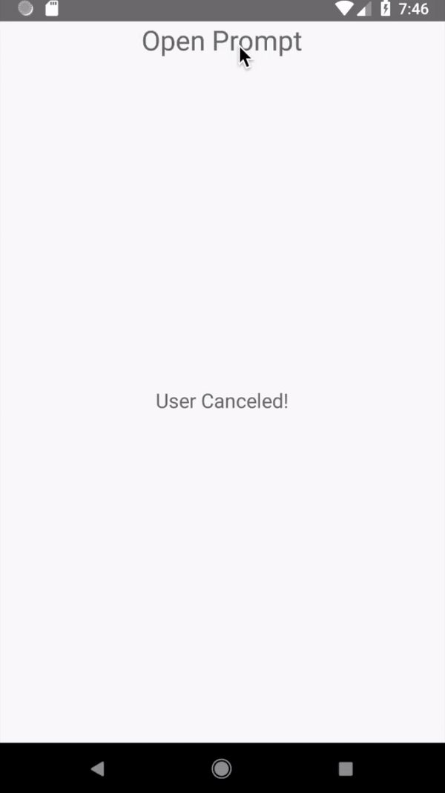

# react-native-input-prompt

A cross-platform input prompt component for React Native.

## Installation

```sh
$ npm install --save react-native-input-prompt
```
## Demo


| iOS                    | Android                 |
| ---------------------- | ----------------------- |
|  |  |

## Basic Usage

```js
<Prompt
    visible={this.state.visible}
    title="Say Something"
    placeholder="Type Something"
    onCancel={() =>
        this.setState({
            text: "User Cancelled!",
            visible: !this.state.visible
        })
    }
    onSubmit={text =>
        this.setState({
            text: "User submitted: " + text,
            visible: !this.state.visible
        })
    }
/>
```

## API

Props:

*   `title` (string, required): The title to be displayed on the prompt.
*   `visible` (boolean, required): When `true`, the prompt is displayed, closes otherwise.
*   `placeholder` (string, required): The placeholder text of the prompt.
*   `cancelText` (string): The string that is displayed on the cancel button (defaults to "Cancel").
*   `submitText` (string): The string that is displayed on the submit button (defaults to "Submit").
*   `cancelButtonStyle` (object): To change the style of "Cancel button".
*   `submitButtonStyle` (object): To change the style of "Submit button".
*   `cancelButtonTextStyle`(object): To change the style of text displayed inside "Cancel button".
*   `submitButtonTextStyle` (object): To change the style of text displayed inside "Submit button".
*   `titleStyle` (object): To change the style of title text.
*   `onChangeText` (function): Function that is called with user input when it changes.
*   `onSubmit` (function, required): Function that is called when user presses on "Submit button".
*   `onCancel` (function, required): Function that is called when user presses on "Cancel button".

## Contributing

Don't find what you want or want to improve the project?

Feel free to fork the project and submit a pull request with your changes!

Not familiar or feeling lazy? Open issue about your idea or tip!

## License

MIT

**Free Software, Hell Yeah!**
